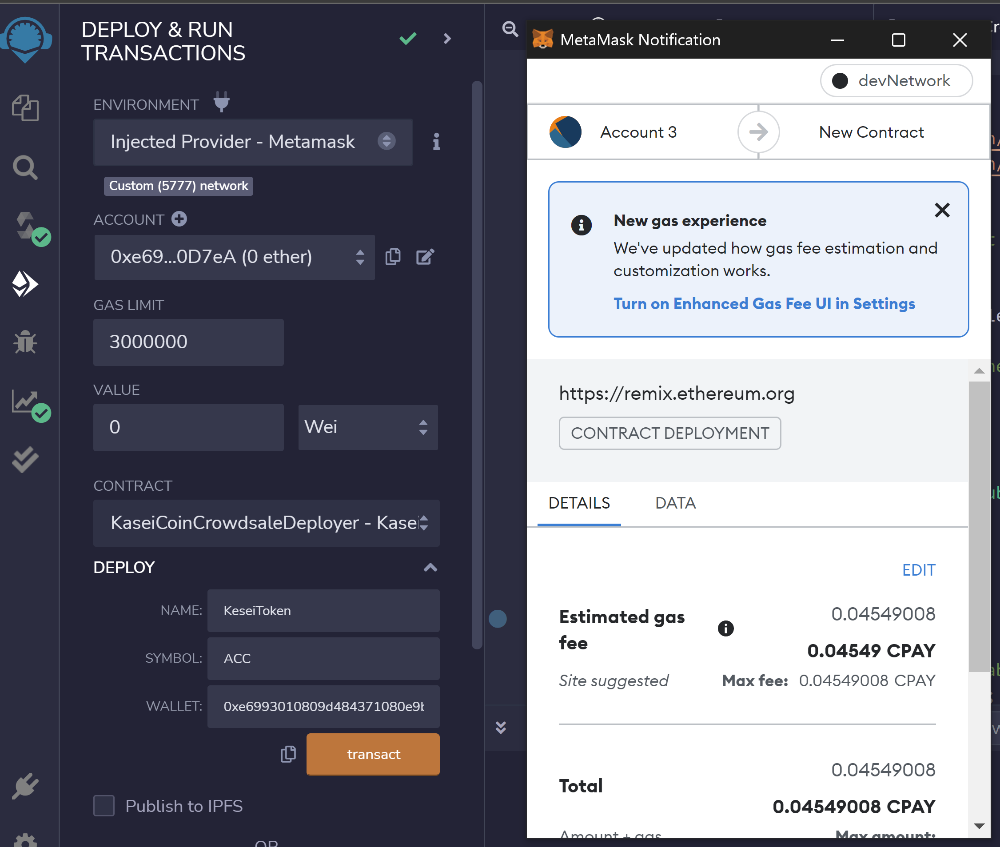
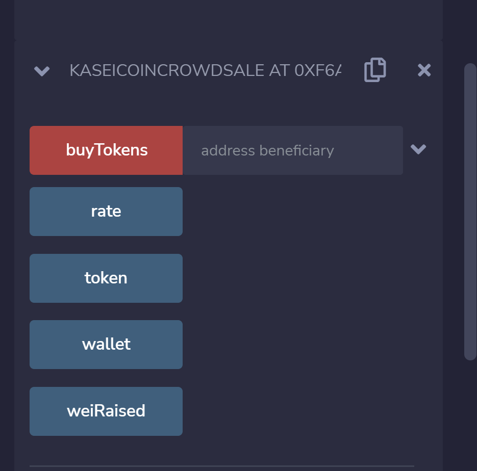
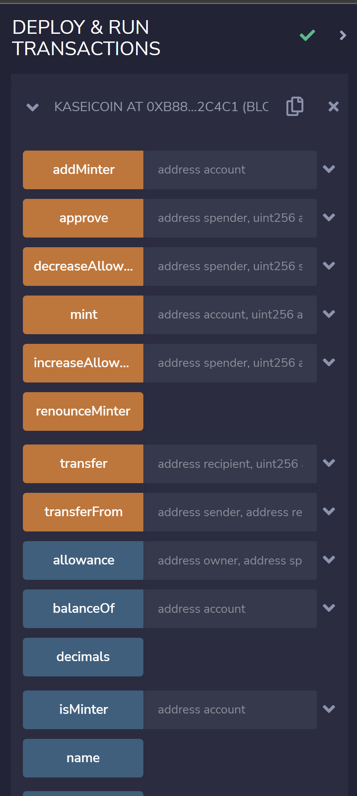

# Application

## Challenge: Martian Token Crowdsale

You will create a fungible token that is ERC-20 compliant and that will be minted by using a `Crowdsale` contract from the OpenZeppelin Solidity library.

The crowdsale contract created. This contract manages the entire crowdsale process, allowing users to send ether to the contract and in return receive KAI, or KaseiCoin tokens. The contract mints the tokens automatically and distribute them to buyers in one transaction.

### STEPS INVOLVED

Following steps were done to complete the given task:

1. KaseiCoin Token Contract created

2. KaseiCoin Crowdsale Contract created

3. KaseiCoin Deployer Contract created

4. Deployment of the Crowdsale to a Local Blockchain

#### Evidences

- Deployment and connectivity with Ganache using MASK
  

- Deployment of deployer and then contract. All fields avaiable. 
  

